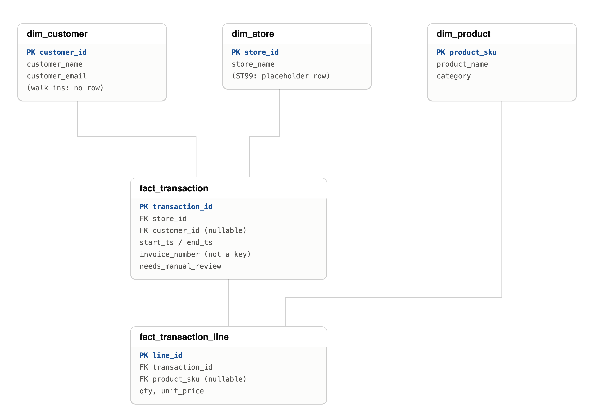

# neighbourhood-pos-reconstruction

**Practice Project: POS Data Modeler**
Self-directed prep for the Atira Data Modeler (Forms-to-Repository Migration) role — Data for Good

**Status: all 7 tasks complete.** See the Deliverables Checklist below for what each task
produced, or `PROJECT_DOCUMENTATION.md` for the full task-by-task reasoning and verification.

## Scenario

You're supporting a small community retail partner, Neighbourhood Made Co-op, a nonprofit gift shop that funds a job-training program. Their point-of-sale system exports a flat CSV of transaction line items — no clean invoice structure, inconsistent formatting, and identifiers that don't always agree with the store reference list. Your job is the same shape as the real Atira brief: take raw, semi-structured operational data, validate your assumptions about how it's organized, reconstruct the real transactions hidden inside it, and turn it into a structured model someone could actually report on.

## Files Provided

- `data/raw_pos_export.csv` — 131 rows, one row per product line item, generated to be realistically messy.
- `data/store_lookup.csv` — a small reference table mapping `store_id` to `store_name`.

## Columns in raw_pos_export.csv

| Column | Notes |
|---|---|
| `row_id` | Sequential export row number — not a transaction identifier |
| `store_id` | Should join to `store_lookup.csv` — check that assumption |
| `register_id` | Physical till number within a store |
| `cashier_name` | Free text, entered inconsistently |
| `transaction_ts` | Timestamp of the line item — watch the format |
| `invoice_number` | Populated only some of the time |
| `customer_ref` / `customer_name_raw` / `customer_email_raw` | Blank for walk-ins; may be entered inconsistently for repeat customers |
| `product_sku` / `product_name_raw` / `category_raw` | Product info, denormalized and inconsistently cased |
| `qty` | Can be negative |
| `unit_price_raw` | Text field — formatting is not consistent |
| `discount_code` / `payment_method` / `line_note` | Supporting transaction detail |

## What to Watch For

Without giving away every answer, here's the category of issues the export contains — the same categories you'd realistically hit migrating any operational export into a repository:

- **Missing structural keys:** `invoice_number` isn't always there, and when it is, it isn't guaranteed to be unique across the whole file.
- **Inconsistent formats:** more than one timestamp format, more than one way of writing a price, inconsistent text casing.
- **Identity ambiguity:** the same real customer may show up under slightly different names or emails across visits.
- **Referential mismatches:** not every `store_id` in the export necessarily exists in the lookup table, and not every store in the lookup table is necessarily used.
- **Duplicate and incomplete rows:** a few exact duplicate submissions, and a few rows with missing critical fields.
- **Returns:** negative quantities exist and need a modeling decision — separate transaction, or a line within the original one?

## Tasks

These map directly to the Atira job responsibilities — treat this like the actual assignment.

### 1. Profile the data

Load `raw_pos_export.csv` and document what you find: null rates per column, duplicate rows, distinct value counts for `store_id`/`category_raw`/`payment_method`, and anything that looks structurally off. Write this up as a short data quality notes section — don't just eyeball it, show the counts.

### 2. Validate your assumptions about structure and sorting

Before you can reconstruct anything, state your assumptions explicitly and test them against the data. For example: is `row_id` a reliable proxy for chronological order within a register? Does a non-blank `invoice_number` always group the correct set of line items? Is `transaction_ts` sortable as-is across all its formats? Write down each assumption, how you tested it, and whether it held.

### 3. Reconstruct invoices from the line items

Define a rule for grouping line items into a single transaction when `invoice_number` is missing (for example: same store + register + customer, timestamps within a tight window of each other). Apply it, and then spot-check a handful of reconstructed transactions against the raw rows to see whether the rule holds up or over/under-groups.

### 4. Build the logical and physical data model

Design a normalized structure — think in terms of a transaction/invoice entity, a line-item entity, and reference entities for customer, product, and store. Draw the entity relationship diagram (boxes and keys is fine) and then write the physical schema as `CREATE TABLE` statements, ideally in T-SQL since the real role is Microsoft-platform-facing.

### 5. Resolve the store reference mismatch

Compare `store_id` values in the export against `store_lookup.csv`. Decide and document how you'd handle any store that appears in one file but not the other — this is the same judgment call as reconciling systems during a migration.

**Write-up:** [`05_STORE_RECONCILIATION.md`](05_STORE_RECONCILIATION.md) — quantifies the mismatch (~33% of revenue), weighs four options, and documents the decision plus an escalation note for how this would be handled in a real migration.

### 6. Generate analysis and a chart

Using Python/pandas or Power Query, produce: revenue by category and by store, top 5 products by revenue, and a return rate. Make one simple chart (bar or line) that would support a stakeholder narrative.

### 7. Write the impact story

In 3–5 plain-language sentences, summarize what the data shows and flag any caveats a non-technical stakeholder should know about (e.g., "revenue by store is directional, not exact, because roughly N% of transactions couldn't be reliably grouped"). This is the requirements-elicitation and communication skill the job posting calls out directly.

**Write-up:** [`07_IMPACT_STORY.md`](07_IMPACT_STORY.md) — the final plain-language narrative, no jargon, caveats named directly.

## Entity Relationship Diagram



Three reference tables (`dim_customer`, `dim_store`, `dim_product`) feed two fact tables
(`fact_transaction`, `fact_transaction_line`). Full reasoning behind each key and nullability
decision is in `PROJECT_DOCUMENTATION.md`, Task 4. Physical schema: `sql/schema.sql`.

## Deliverables Checklist

- [x] Data profiling notes (with actual counts, not just observations) — `notebooks/01_profile.ipynb`
- [x] A written assumption log for the structure/sorting validation step — `notebooks/02_validate_assumptions.ipynb`
- [x] Your invoice reconstruction logic (script or query) plus the resulting transaction-level table — `notebooks/03_reconstruct_invoices.ipynb`, `output/practice.db`
- [x] An ERD and T-SQL `CREATE TABLE` statements for the normalized model — `images/neighbourhood_pos_erd.png`, `sql/schema.sql`
- [x] A short write-up of how you resolved the `store_id` mismatch — `05_STORE_RECONCILIATION.md`
- [x] Analysis output: category/store revenue, top products, return rate, one chart — `notebooks/06_analysis.ipynb`, `output/revenue_by_store.png`
- [x] A 3–5 sentence stakeholder-facing narrative — `07_IMPACT_STORY.md`

Full task-by-task reasoning, findings, and verification for all 7 tasks: `PROJECT_DOCUMENTATION.md`.

## Suggested Tools & Time-Box

Python (pandas) or Power Query for the cleaning and reconstruction. SQL Server, Azure SQL, or a Fabric Lakehouse for the modeling step — local SQLite is a fine stand-in if you don't want to spin up an Azure resource just for practice. Time-box this to 4–6 hours across a weekend; if it's taking much longer, that's useful information about which step needs more reps before the real interview.

## Self-Assessment Rubric

| JD Requirement | Check your work against |
|---|---|
| Logical & physical data modeling | You produced both an ERD and actual DDL, not just a description |
| Relational design & normalization | No repeating groups; every table has a clear primary key and correct foreign keys |
| Migration / modernization support | You explicitly documented how you handled the `store_id` mismatch, not just ignored it |
| Unstructured/semi-structured → structured model | Your invoice reconstruction rule is explicit and you spot-checked it against raw rows |
| Requirements elicitation from non-technical stakeholders | Your impact-story narrative is in plain language and names a real caveat |
| Basic Microsoft data platform | Your physical schema is written in T-SQL, or you loaded the model into Azure SQL/Fabric |
| 2+ years judgment | You made and documented at least one debatable modeling call rather than picking the first option |

## After You're Done

A separate file, `solution_hints.md`, is included alongside the data files — it names the actual planted issues and shows one reasonable grouping rule and schema. Don't open it until you've attempted the tasks above; the value of this exercise is in the judgment calls, not the answer key.

## Repo Structure

```
neighbourhood-pos-reconstruction/
├── README.md
├── PROJECT_DOCUMENTATION.md
├── 05_STORE_RECONCILIATION.md
├── 07_IMPACT_STORY.md
├── SETUP.md
├── solution_hints.md
├── data/
│   ├── raw_pos_export.csv
│   └── store_lookup.csv
├── images/
│   ├── neighbourhood_pos_erd.png
│   └── neighbourhood_pos_erd.svg
├── notebooks/
│   ├── 01_profile.ipynb
│   ├── 02_validate_assumptions.ipynb
│   ├── 03_reconstruct_invoices.ipynb
│   ├── 04_model.ipynb
│   └── 06_analysis.ipynb
├── sql/
│   └── schema.sql
└── output/
    ├── practice.db
    └── revenue_by_store.png
```
